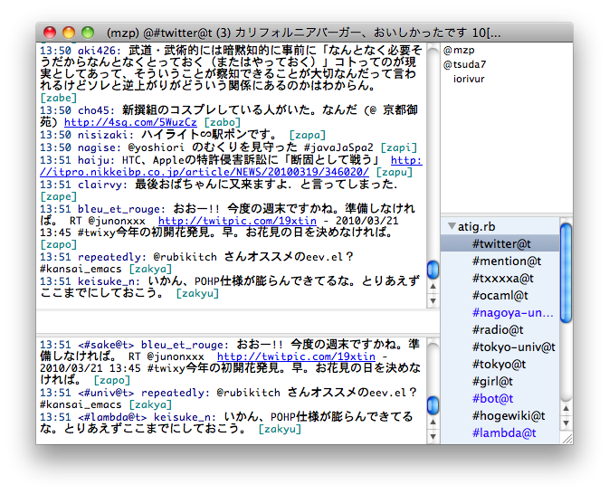
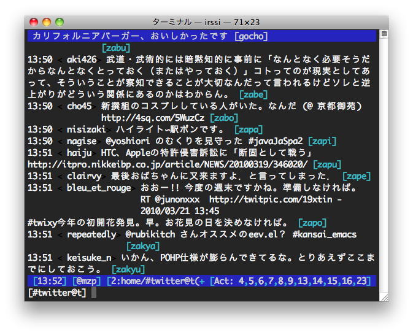
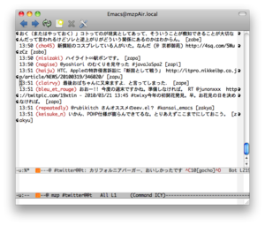

atig.rbの特徴
==============================

主な機能
------------------------------
 * フレンドタイムライン/DM/Mentionの取得
 * OAuthによる認証
 * ListsによるFollowingの分類
 * 公式RT/コメント付き非公式RT
 * IRCクライアントならなんでも使える柔軟性

動作環境
------------------------------
開発時には以下の環境でテストしています。

 * MacOS 10.5(Leopard) + Ruby 1.9
 * MacOS 10.6(Snow Leopard) + Ruby 1.9
 * CentOS 5.3 + Ruby 1.8

スクリーンショット
------------------------------

`Lime Chat`_
~~~~~~~~~~~~~~~~~~~~~~~~~~~~~~
.. _Lime Chat: http://limechat.net/

`Irssi`_
~~~~~~~~~~~~~~~~~~~~~~~~~~~~~~
.. _Irssi: http://www.irssi.org/

`Riece`_ on Emacs.
~~~~~~~~~~~~~~~~~~~~~~~~~~~~~~

.. _Riece: http://www.nongnu.org/riece/index.html.ja

