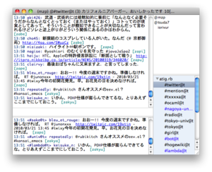

.. atig documentation master file, created by
   sphinx-quickstart on Mon Mar 15 15:36:01 2010.
   You can adapt this file completely to your liking, but it should at least
   contain the root `toctree` directive.

atig.rb : Another Twitter Irc Gateway
==================================
atig.rbはTwitterとIRCを結ぶゲートウェイです。

スクリーンショット
------------------------------

ダウンロード
------------------------------

 - 安定板: `atigrb-0.3.2.tgz`_. ( `過去のバージョン`_ )
 - 開発版: `Github Repository`_.

.. _atigrb-0.3.2.tgz: http://github.com/mzp/atig/tarball/v0.3.2
.. _過去のバージョン: http://github.com/mzp/atig/downloads
.. _GitHub Repository: http://github.com/mzp/atig

既知のバグ
------------------------------

 - sqlite3-ruby 1.3.0/1.3.1に対応していません。(`Issue 2`_ )

.. _Issue 2: http://github.com/mzp/atig/issues#issue/2

特徴
------------------------------

必要なのはIRCクライアントだけ
~~~~~~~~~~~~~~~~~~~~~~~~~~~~~~~~~

 - IRCクライアントさえあれば、どこからでもTwitterできます。
 - CUI中毒やEmacs中毒の方でも安心してお使いいただけます。

Listsにも対応してます
~~~~~~~~~~~~~~~~~~~~~~~~~~~~~~~~~

 - Listsはチャンネルになります。

大抵のOSで動きます
~~~~~~~~~~~~~~~~~~~~~~~~~~~~~~~~~

 - Rubyで書いてあるので大抵のOSで動作します。

IRC用のソフトが流用できます。
~~~~~~~~~~~~~~~~~~~~~~~~~~~~~~~~~

 - 既存のIRC用のソフトを流用することができます。
 - 例えば、IRCプロキシであるTiarraと連携させることで、24時間Twitterのログがとることが可能です。

.. 構造化された設計
   ~~~~~~~~~~~~~~~~~~~~~~~~~~~~~~

    ~ tig.rbよりいいよ

その他のドキュメント
------------------------------
.. toctree::
   :maxdepth: 2

   quickstart
   feature
   irc
   commandline_options
   options
   commands
   config
   tig
   changelog

バグ、疑問点、不満点を見つけたときは
------------------------------------

こんな場合は、mzpまで気軽にご連絡ください。
できる範囲でサポートします。

 - atig.rbの挙動がおかしい
 - 設定の仕方がよく分からない
 - 欲しい機能がなかった
 - atig.rbに足りないクールな機能を実装したぜ

連絡方法は以下のものがあります。それ以外の方法でもmzpまでに届けばかまいません。

 - Githubの `Issues`_ に登録する。
 - `@mzp`_ 宛につぶやく。
 - `Blog`_ の適当なページにコメントをつける
 - Githubでforkして、pull requestを送る

.. _Issues: http://github.com/mzp/atig/issues
.. _@mzp: http://twitter.com/mzp/
.. _Blog: http://d.hatena.ne.jp/mzp/

Indices and tables
==================

* :ref:`genindex`
* :ref:`search`

.. |heart| replace:: ♥
