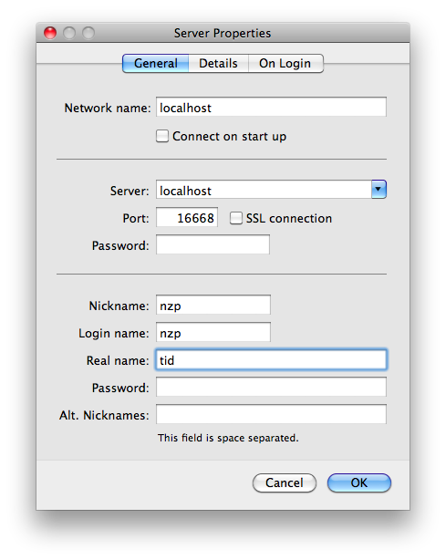
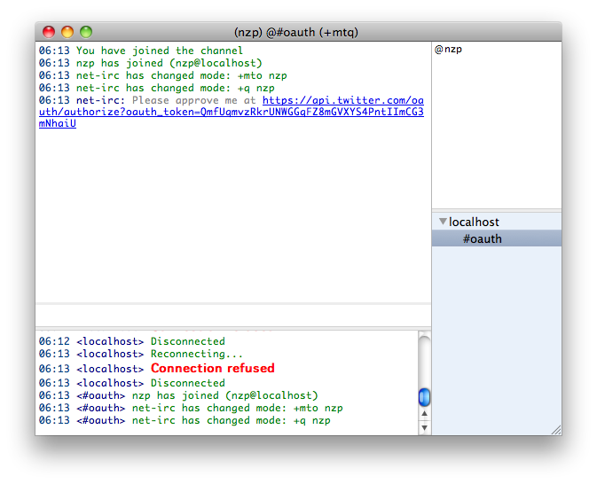
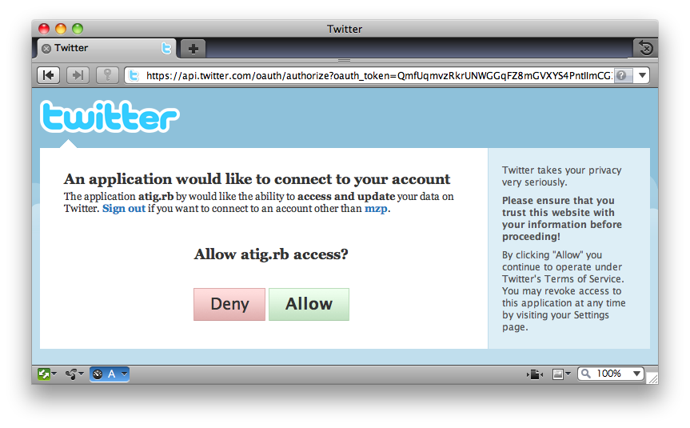
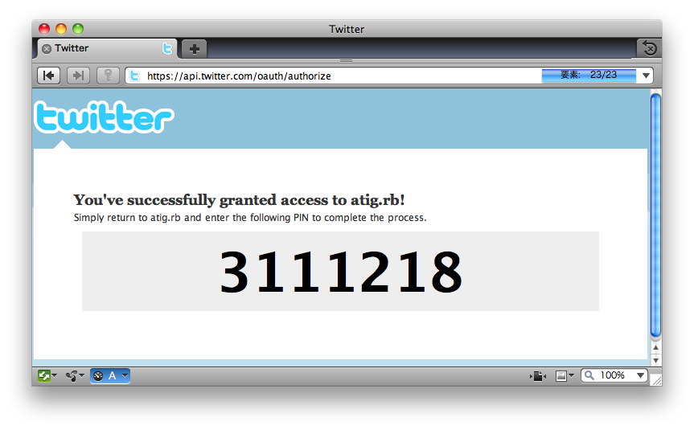

クイックスタート
================

必要なソフトウェア
------------------------------
以下のものが必要です。

 - Ruby 1.8/1.9
 - Sqlite3
 - 適当なIRCクライアント(例: `LimeChat`_ )

.. _LimeChat: http://limechat.net/

またRubyには次のライブラリがインストールされている必要があります。

 - oauth
 - sqlite3-ruby
 - json(Ruby 1.8の場合, Ruby 1.9の場合は不要)
 - rspec(単体テストを実行する場合, 開発者以外は不要)
 - rake(単体テストを実行する場合, 開発者以外は不要)

インストール
------------

リリース版
~~~~~~~~~~
Rubygemsを使用してインストールしてください。::

 $ gem install atig

または `GitHub`_ からダウンロードしてください。

.. _GitHub: http://github.com/mzp/atig/downloads

trunk版
~~~~~~~~~~
githubからpullしてください。::

 $ git clone https://github.com/mzp/atig.git

使ってみる
----------

起動
~~~~~~~~~
コマンドラインから起動します。::

 $ atig -d

githubからダウンロードした場合::

 $ cd atig
 $ bin/atig -d
 I, [2010-04-05T07:22:07.861527 #62002]  INFO -- : Host: localhost Port:16668

接続
~~~~~~~~~
IRCクライアントで、localhost:16668に接続します。

 - nickname: Twitterのユーザ名
 - login name: 使ってないので適当に
 - real name: :doc:`options` 。tidがおすすめです。
 - password: 空欄
 - 詳しくは :doc:`irc` を参照してください。

OAuth認証
~~~~~~~~~
初回接続時のみ、OAuthで認証させる必要があります。
接続時に#oauthにjoinされ、認証用のURLが表示されます。

表示されたURLにアクセスし、atig.rbに認証を与えます。

7桁の数字が表示されるので、それを#oauthに入力します。

発言してみる
~~~~~~~~~~~~
 - #twitterで発言すると、Twitterに投稿されます。
 - :doc:`commands` を用いると、RTやreplyが行なえます。

さらに詳しい使い方
--------------------

 - Tiarraと連携させると、発言のログを取ることができす。
 - `God`_ などと連携させると、atig.rbを常駐(デーモン化)させることができます。

.. _God: http://god.rubyforge.org/
